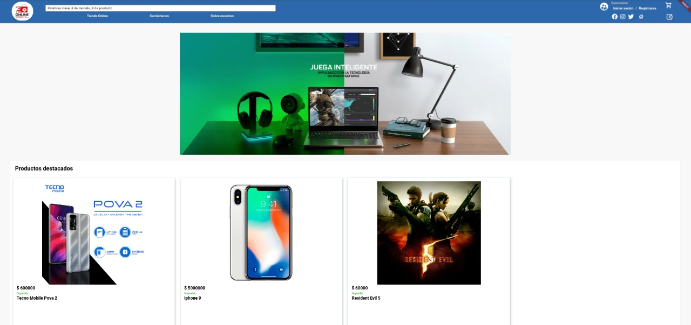
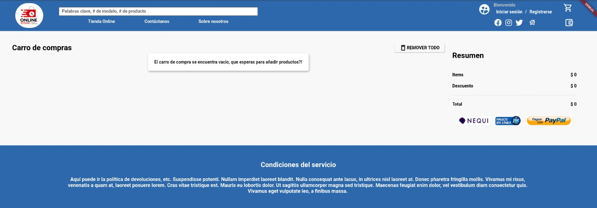
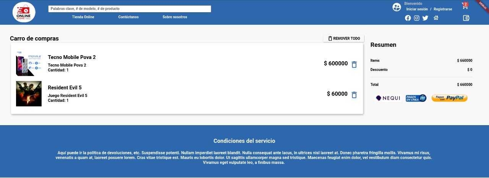

# Ecommerce - Front

Aplicación web para una ecommerce usando flutter y los paradigmas de programación procedimentales y orientado a objetos.

## Autores

- Sergio David Paez Suarez - **20191020167**
- Jesus Manuel Leiva Bermudez - **20191020167**
- Jesus Alberto Lozada Montiel- **20191020167**

## Ejecución en modo desarrollo

Para poder ejecutar el proyecto se debe primero configurar una clase que contenga, las variables globales a utilizar en el proyecto.

```console
flutter pub run environment_config:generate -u ${HOST} -p ${PORT} -e ${CONTEXT_PATH} -t ${TOKEN_ACCESS_NAME}
```

Una vez hecho esto se ejecuta el proyecto de la siguiente forma.

```console
 flutter run -d chrome --web-renderer=html
```

## Estructura de archivos

```
├── environment_config.yaml
├── images
│   ├── banner01.png
│   ├── logo.png
│   ├── notfound.png
│   └── objeto.png
├── lib
│   ├── constants
│   │   ├── colors.dart
│   │   ├── constants.dart
│   │   └── text_styles.dart
│   ├── generated_plugin_registrant.dart
│   ├── main.dart
│   ├── models
│   │   ├── category.dart
│   │   ├── client.dart
│   │   ├── generic.dart
│   │   ├── identifier_type.dart
│   │   ├── product.dart
│   │   ├── purchased.dart
│   │   └── transaction.dart
│   ├── private
│   │   └── environment_config.dart
│   ├── screens
│   │   ├── footer.dart
│   │   ├── header.dart
│   │   ├── home
│   │   │   └── home.dart
│   │   ├── product
│   │   │   └── product.dart
│   │   ├── register
│   │   │   └── sign_up.dart
│   │   └── screens.dart
│   ├── services
│   │   └── handlers
│   │       ├── authHandler.dart
│   │       ├── clientsHandler.dart
│   │       ├── identifierTypeHandler.dart
│   │       ├── productsHandler.dart
│   │       ├── purchaseHandler.dart
│   │       └── transactionHandler.dart
│   └── util
│       ├── alerts.dart
│       ├── http_client.dart
│       ├── logger.dart
│       └── request_conversor.dart
├── pubspec.lock
├── pubspec.yaml
├── README.md
└── test
    └── widget_test.dart
```

## Vistas








